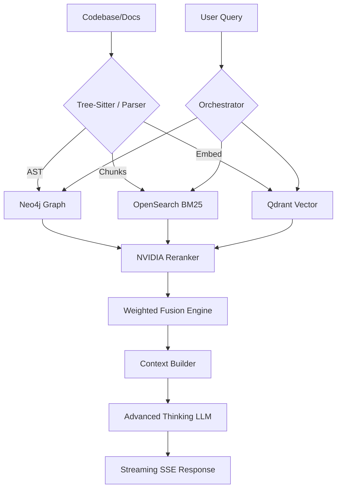

# HyperRAG — Advanced Hybrid RAG Backend

Production-grade, headless hybrid RAG backend designed for IDE Intelligence, codebases, and high-precision document analysis. Built for performance, accuracy, and deep structural awareness.

---

## Key Features

- **Quad-Hybrid Retrieval:** Combines BM25, Vector Search, Knowledge Graph, and PageIndex tree-search into a single fusion engine.
- **Universal Code Indexing:** Advanced relationship extraction for any codebase using Tree-Sitter AST Traversal (captures imports, calls, and definitions).
- **NVIDIA NIM Integration:** Powered by llama-3.2-nv-embedqa (Embeddings) and llama-3.2-nv-rerankqa (Reranking) for high-precision retrieval.
- **Dynamic Truth Layer:** Neo4j stores architectural relationships for deeper context beyond simple text similarity.
- **Configurable Matrix Fusion:** Fully customizable weighting for Rerank, BM25, Vector, and Graph scores at query time.
- **Smart Exclusions:** Handles Python, JS/TS, Rust, Go, C++, and more via a universal ignore system and .hyperragignore support.
- **Project Isolation:** All artifacts are stored in project-scoped subfolders within data/processed/.

---

## Architecture

HyperRAG uses a "Relevance-First" architecture, moving beyond simple similarity search.

1. **Extraction:** Tree-Sitter AST parsing vs. traditional text splitting.
2. **Indexing:** Triple-sync across Qdrant (Vector), OpenSearch (BM25), and Neo4j (Graph).
3. **Retrieval:** Parallel multi-source fetch.
4. **Fusion:** Cross-encoder reranking followed by configurable weighted fusion.
5. **Generation:** SSE streaming with interleaved reasoning/thinking tokens from advanced LLM providers.



---

## Core Workflow

### 1. Installation
```bash
docker-compose up -d
pip install -r requirements.txt
```

### 2. Universal Ingestion
```bash
python scripts/ingest_folder.py "D:/Path/To/Project"
```
*Supports deep structural awareness for code and hierarchical reasoning for documents.*

### 3. API Deployment
```bash
python src/main.py --api
```
*Starts the API server at http://127.0.0.1:8000.*

---

## Configuration

### Smart Ignoring
HyperRAG handles common build artifacts automatically. For project-specific exclusions, add a **.hyperragignore** file in your project root:
```text
# .hyperragignore example
secret_dir/
temp_*.txt
*.min.js
```

### Retrieval Weights
Fine-tune the relevance model via the /query API using the weights object. Default is 0.35 Rerank, 0.25 Vector, 0.25 BM25, 0.15 Graph.

---

## Integration

| Feature | Endpoint | Description |
|---|---|---|
| Query | POST /query | Streaming SSE with optional weights and thinking tokens. |
| Ingest | POST /ingest | Scoped folder ingestion with progress updates. |
| Health | GET /health | Check service status and LLM availability. |

For detailed specifications, see the [API Documentation](docs/api.md).

---
© 2026 HyperRAG
