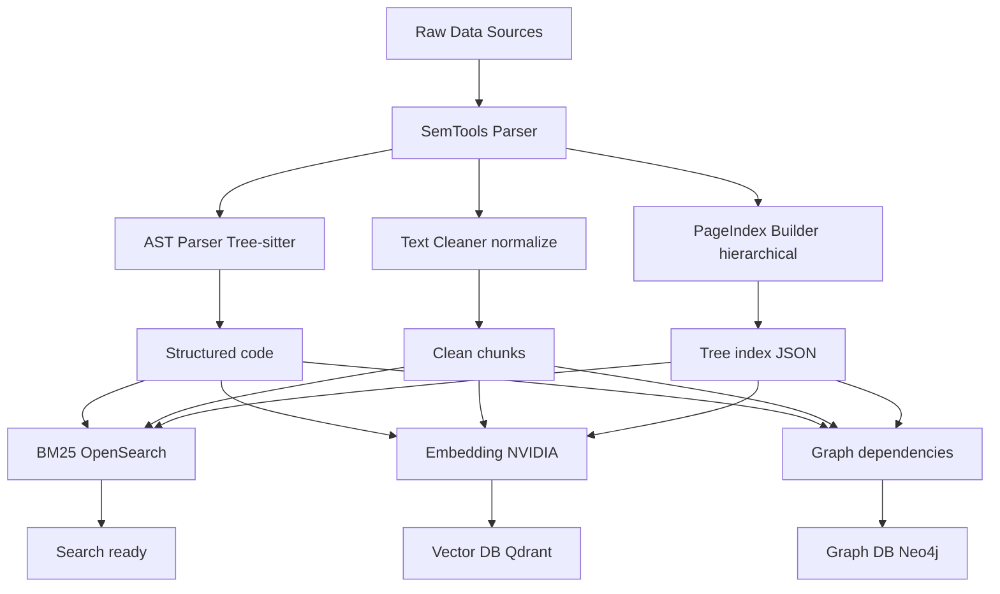

# HyperRAG — Advanced Hybrid RAG System

Production-grade Retrieval-Augmented Generation with:
- Structured ingestion (AST + PageIndex + Graph)
- Hybrid retrieval (BM25 + Vector + Graph)
- NVIDIA reranking + intelligent fusion
- Selective PageIndex reasoning
- Graph as truth layer

## Architecture

**Pipeline Overview:**
- Raw data (code, docs, PDFs, logs)
	→ SemTools parser (clean + structured)
		→ AST parser, Text cleaner, PageIndex builder
			→ BM25 (OpenSearch), Vector DB (Qdrant), Graph DB (Neo4j)
				→ Hybrid retrieval, NVIDIA reranking, Fusion

(Arch Diag)



## Quick Start

```bash
cp .env.example .env
# Fill your NVIDIA API key, OpenSearch/Qdrant/Neo4j credentials

pip install -r requirements.txt

# Ingest sample data
python scripts/ingest_folder.py data/raw/

# Run a test query
python scripts/query_cli.py "Your question here"
```

## Modules

src/ingestion/ — SemTools + Tree-sitter + PageIndex  
src/retrieval/ — Multi-retriever + NVIDIA reranker + Fusion  
etc.