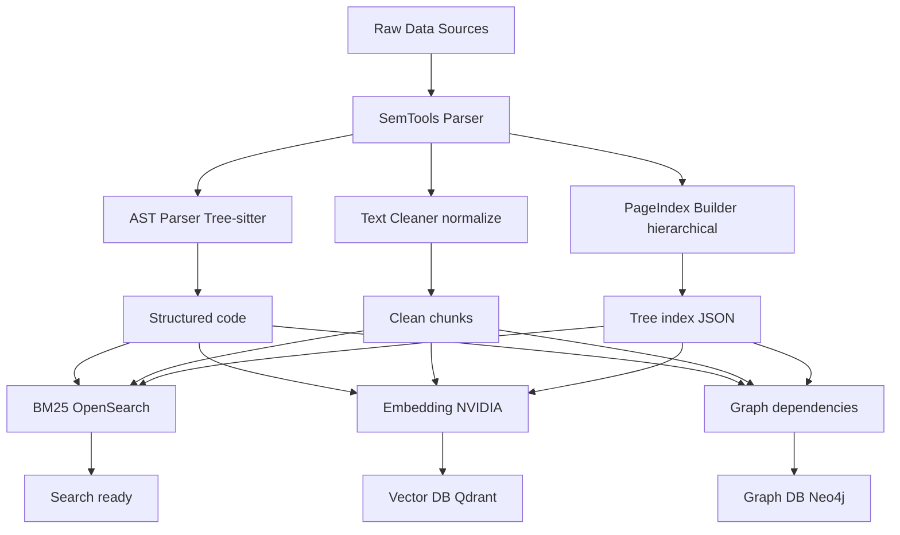

# HyperRAG — Advanced Hybrid RAG Backend

Production-grade hybrid RAG system with structured ingestion, multi-retrieval, NVIDIA reranking, graph truth layer, and intelligent fusion.

Designed as a **portable backend** for VS Code extensions, IDEs, and CLI tools. It provides a robust context-gathering engine that can be used independently of any specific LLM.

## Architecture

User Query / IDE
↓
[ /query ] → Query Planner → BM25 + Vector + Graph + PageIndex
↓
NVIDIA Reranker → Fusion Layer (Weighted Fusion)
↓
Context Builder → [Optional] LLM Generator



## Features
- **Hybrid Retrieval:** BM25 + Vector + Graph + Selective PageIndex.
- **Dynamic Truth Layer:** Neo4j for relationship-based knowledge.
- **Live Indexing:** Real-time progress (SSE) for easy integration into IDE progress bars.
- **Retrieval-Only Mode:** Use the system as a pure context-builder (no LLM key required).
- **Quality Gate:** NVIDIA reranking ensures higher accuracy before context construction.

## Documentation
For detailed endpoint specifications, request/response examples, and integration patterns, see the [API Documentation](docs/api.md).

## Quick Start

```bash
# 1. Start databases
docker-compose up -d

# 2. Install dependencies
pip install -r requirements.txt

# 3. Add your keys in .env (if using LLM)

# 4. Start API server
python src/main.py --api
```

**Interactive API Docs (Swagger):** `http://127.0.0.1:8000/docs`
